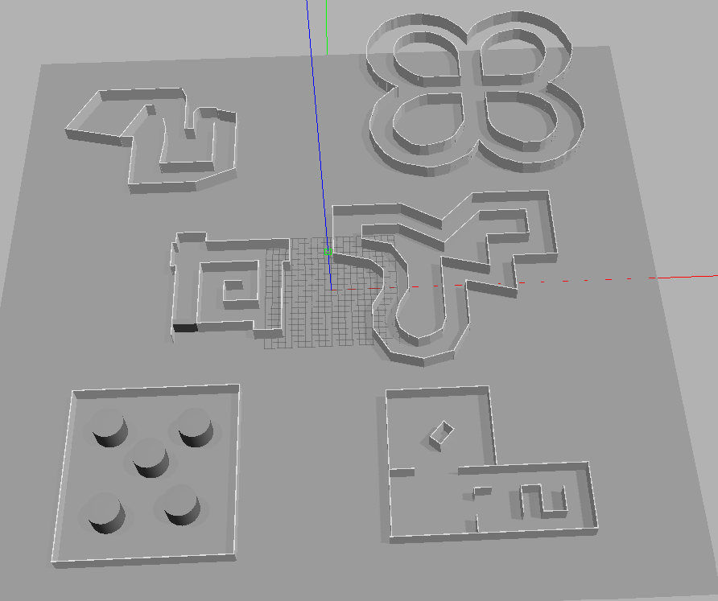

<div align="center">
  <h1>Deep Reinforcement Learning for Collision Avoidance</h1>
  <h3>Autonomous Navigation in Skid-Steering Mobile Robots</h3>
</div>


https://github.com/user-attachments/assets/eb778650-6ac1-472a-8410-92e39de57616


This repository contains the codebase and implementation details for training and evaluating Deep Reinforcement Learning (DRL) agents on a custom Skid-Steer robot in a Gazebo simulation environment. 

The project overcomes the limitations of standard DDQN baselines by introducing **Active Reward Shaping**, a **Dueling DDQN architecture with Prioritized Experience Replay (PER-D3QN)**, and an **Event-Driven Lock-Step Execution** pipeline in ROS 2.

## Prerequisites

- **ROS 2** (Humble) and **Gazebo** (Classic 11) installed.
- **Python 3.10** or higher.
- Install dependencies from `requirements.txt`:
  ```bash
  sudo apt update && sudo apt install python3-pip
  pip install -r requirements.txt
  ```

### Skid-Steer Robot Package

This environment relies on a custom Skid-Steer robot model. You need to clone its repository into your workspace's `src` folder (next to this repository):

```bash
cd ~/ros_project_ws/src
git clone https://github.com/odobot/ROS2-SKID-STEER-DRIVE-ROBOT.git
```

*Note: Replace the original robot description `xacro` files in the cloned repo with the versions provided in this repository (`xacro/skid.xacro` and `xacro/gazebo_control.xacro`) to include the LiDAR sensor and optimal physical properties. Then rebuild the workspace.*

## Building the Workspace

To build the package, navigate to the root of your ROS 2 workspace:

```bash
cd ~/ros_project_ws
colcon build --symlink-install
source install/setup.bash
```

## Technologies and Libraries

- **Languages:** Python 3
- **Deep Learning / RL:** PyTorch
- **Robotics Framework:** ROS 2
- **Simulation:** Gazebo 11
- **Data Processing & Visualization:** NumPy, Pandas, Matplotlib

## Training the Agents

<p align="center">
  <!-- Place the Multi-map image here to show where the agent trains -->
  
</p>


### Terminal 1: Start the Simulation
Launch the Gazebo environment. We engineered an event-driven lock-step execution pipeline to maximize the simulation's Real Time Factor (RTF).

```bash
ros2 launch collision_avoidance_pkg sim_environment.launch.py gui:=false world_file:=multi_maps.world speedup:=true
```
**Launch Arguments:**
- `gui` *(default: false)*: Set to `true` to open the Gazebo GUI. Keep `false` for headless, high-speed training.
- `world_file` *(default: multi_maps.world)*: The map to load from the `worlds/` folder.
- `speedup` *(default: true)*: Runs physics as fast as possible for training. Set to `false` for 1x Real-Time Factor.

### Terminal 2: Run the Agent
Wait for Gazebo to fully load, then run one of the following training scripts. 

**Arguments Available:**
- `--speed` *(default: 0.3)*: Linear velocity for the robot.
- `--learning_rate` *(default: 0.00025)*: Learning rate for the neural network.

1. **Standard DDQN**: Vanilla Double DQN agent.
   ```bash
   ros2 run collision_avoidance_pkg train_ddqn --speed 0.3 --learning_rate 0.00025
   ```
2. **Dueling DDQN (D3QN)**: D3QN agent with separated Value and Advantage streams.
   ```bash
   ros2 run collision_avoidance_pkg train_d3qn --speed 0.3
   ```
3. **PER-D3QN**: Dueling DDQN enhanced with Prioritized Experience Replay for optimal sampling.
   ```bash
   ros2 run collision_avoidance_pkg train_pd3qn --speed 0.3
   ```
4. **PER-DDQN**: Standard DDQN with Prioritized Experience Replay.
   ```bash
   ros2 run collision_avoidance_pkg train_per_ddqn --speed 0.3
   ```

*During training, checkpoints (`.pth`) and performance logs are automatically saved in the `models/` and `plot_data/` directories.*

## Testing the Agents

The `test.py` script evaluates trained agents in the environment, proving their robustness across different topologies.

```bash
ros2 run collision_avoidance_pkg test --model_path "" --speed 0.3 --episodes 20 --lock_step false
```
**Test Arguments:**
- `model_path`: Path to a specific `.pth` file or directory. If left empty `""`, it auto-resolves to the newest model.
- `speed` *(default: 0.3)*: Linear velocity.
- `episodes` *(default: 30)*: Number of evaluation episodes.
- `max_steps` *(default: 1100)*: Max steps before timeout.
- `lock_step` *(default: true)*: Set to `false` for smooth real-time visual evaluation.

## Evaluating Training Performance

To visualize the results and generate graphs:

```bash
cd ~/ros_project_ws/src/CollisionAvoidance-RL
python3 collision_avoidance_pkg/collision_avoidance_pkg/plots.py
```

## Key Results

Our investigation successfully transitioned a baseline DDQN to a robust **PER-D3QN** agent, answering several key engineering questions:

- **Active Reward Shaping**: Replacing a passive survival reward with active forward clearance incentives prevented the agent from spinning in place, promoting proactive obstacle avoidance.
- **Dueling Architecture Benefits**: D3QN separates state value from action advantage. This helped the agent realize that open corridors are inherently safe, yielding smoother trajectories and the highest peak rewards.
- **Sampling Efficiency**: Prioritized Experience Replay (PER) forced the network to learn from critical crash sites rather than redundant safe states. **The combined PER-D3QN yielded the most reliable, low-variance policy during testing on unseen maps.**
- **Simulation Optimization**: We decoupled the PyTorch backend from the Gazebo physics engine clock through lock-step execution.
